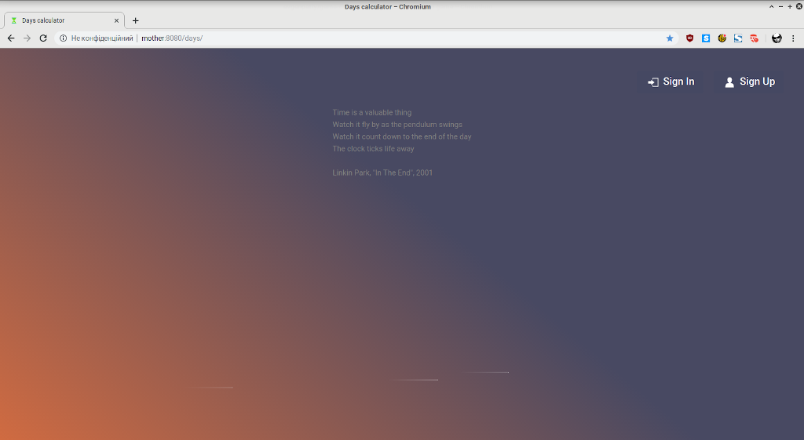
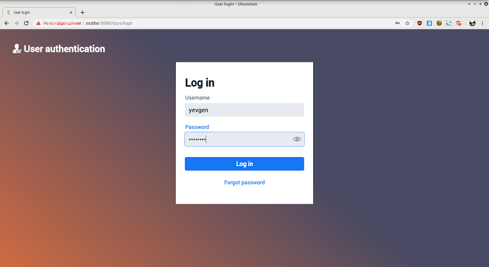
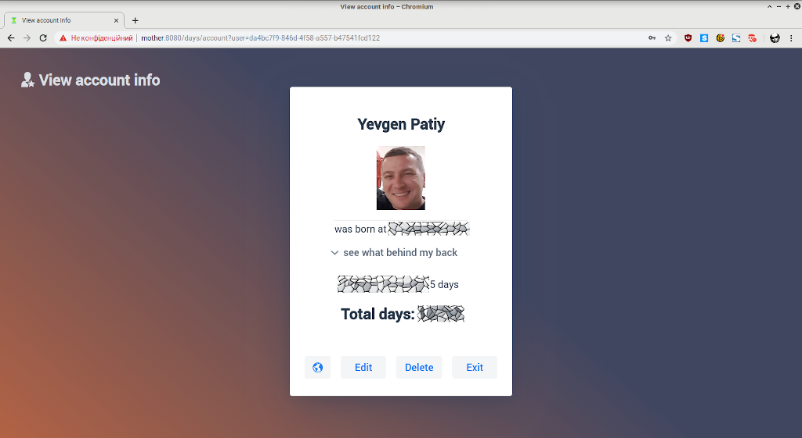
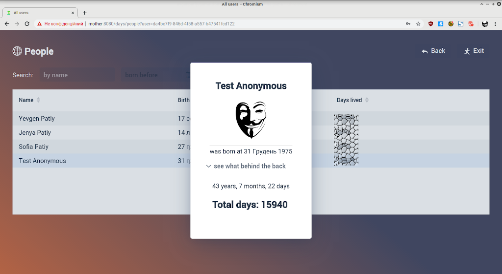

# Web-days-calculator
# (made with Java 8 / Vaadin Flow v13 / PostgreSQL / Spring Boot-Data-Security-Mail) 

Web application to see, how many days you're lived already :)

## Installation and usage (tested on Debian Linux 9.9 / Apache Tomcat 9.0.22)

* Clone current git repository to local machine

`git clone https://github.com/evgenpatiy/web-days-calculator.git`

* Find src/main/resources/application.properties file and fill properties marked XXXXXX with your custom data

* Compile source code using command below. Warning: existing [Java 8](https://java.com/en/download/) and [MAVEN](https://maven.apache.org/) installation required!

`mvn clean package`

WAR file inside **target** dir will be built, fill free to deploy it by yourself

* Automated build and deploy could be produced by:

`mvn clean tomcat7:deploy -Pproduction-mode`, but don't forget to adjust **tomcat7** section of **pom.xml** according to your particular environment

## Author

- Yevgen Patiy

## License

Feel free to use, modify or distribute this software. This project is licensed under the [GNU GPL 2.0 license](https://www.gnu.org/licenses/old-licenses/gpl-2.0.uk.html).
